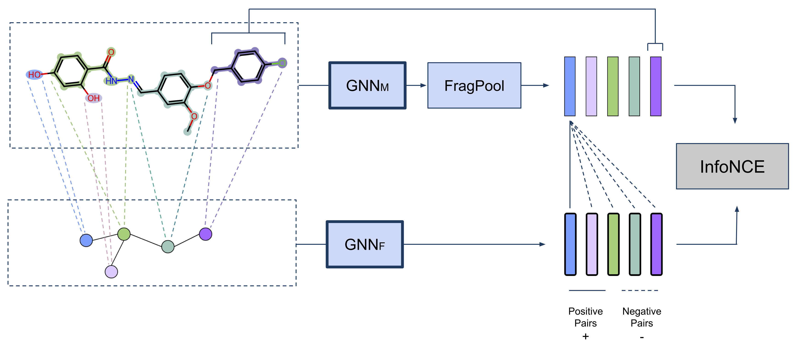
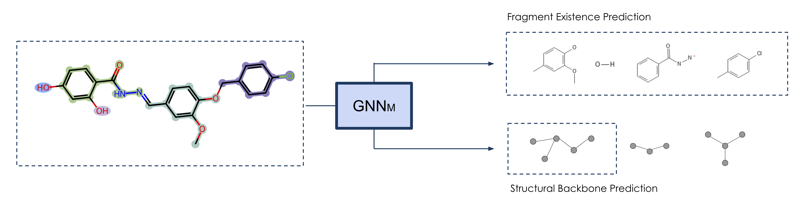

# GraphFP: Fragment-based Pretraining and Finetuning on Molecular Graphs

**NeurIPS 2023**

Authors: Kha-Dinh Luong, Ambuj Singh

[[Paper](https://openreview.net/forum?id=77Nq1KjmLl)]
[[ArXiv](https://arxiv.org/abs/2310.03274)]
[[Slides](https://slideslive.com/s/khadinh-luong-130561)]

In this repository, we provide the code used in the NeurIPS 2023 paper **Fragment-based Pretraining and Finetuning on Molecular Graphs**. We also include the model weights to reproduce the results from the paper.

<p align="center">
   
</p>

<p align="center">
   
</p>

## Environment

The source code is organized into 2 directories:
* `mol`: experiments on small molecule prediction tasks, corresponding to `Table 2` from the paper.
* `long-range`: experiments on long-range datasets, corresponding to `Table 3` from the paper.

The folders contain different chemical featurizations and GNN implementations. To ensure fair comparison with previous works, the `mol` folder contains codes compatible with those from Hu et al. (2019). On the other hand, `long-range` folder contains newer codes, with featurizations and GNN implementations provided in Open Graph Benchmark. As a result, the environment requirements for both scenarios are also different.

The package requirements for `mol` and `long-range` are in `mol/requirements.txt` and `long-range/requirements.txt`, respectively.

## Data Preparation

We need to prepare data before either pretraining or finetuning. This process will create and store a molecular graph and a fragment graph for each molecule based on a vocabulary of fragments. We provide the vocabulary used in the paper in both `mol/vocab.txt` or `long-range/vocab.txt`. In `long-range`, to prepare datasets, run:

```
python prepare_data.py --root <output data path> --data_file_path <raw data path> --smiles_column <column containing smiles in raw file> --vocab_file_path vocab.txt
```

Similarly, in `mol`, run:

```
python prepare_data_old.py --root <output data path> --data_file_path <raw data path> --smiles_column <column containing smiles in raw file> --vocab_file_path vocab.txt
```

Parameters:
`root`: where the processed data should be stored.
`data_file_path`: path to the raw data file, which is expected to be in CSV. There should be 1 column containing SMILES string. The other columns contain task labels.
`smiles_column`: name of the column containing SMILES string in the raw data file.
`vocab_file_path`: path to the file containing the vocabulary of fragments.

## Pretraining

To run pretraining on a prepared pretraining dataset, in `mol`, run:

```
python train_gnn_predictive_old.py --root <path to prepared data> --alpha <weight parameter> --save_path <path to save pretrained model>
```

To train with only the contrastive task, set `alpha` to 0. To train with both contrastive and predictive tasks, set `alpha` to between 0 and 1. To train with only predictive tasks, set `alpha` to 1. The dataset we prepared for pretraining can be accessed [here](https://drive.google.com/file/d/17QGpb3V3kQIDnqSraGBXYqt7KDVxXsEw). Unzip and specify `root` with the path to the unzipped folder. 

Similary, in `long-range`, run:

```
python train_gnn.py --root <path to prepared data> --save_path <path to save pretrained model>
```

We only did contrastive pretraining on long-range benchmark so there is no `alpha` in this case.

## Finetuning

To reproduce finetuning results, please follow the README in `mol` or `long-range`.

## Citation

```
@inproceedings{
    2023fragmentbased,
    title={Fragment-based Pretraining and Finetuning on Molecular Graphs},
    author={Luong, Kha-Dinh and Singh, Ambuj},
    booktitle={Thirty-seventh Conference on Neural Information Processing Systems},
    year={2023},
    url={https://openreview.net/forum?id=77Nq1KjmLl}
}
```
